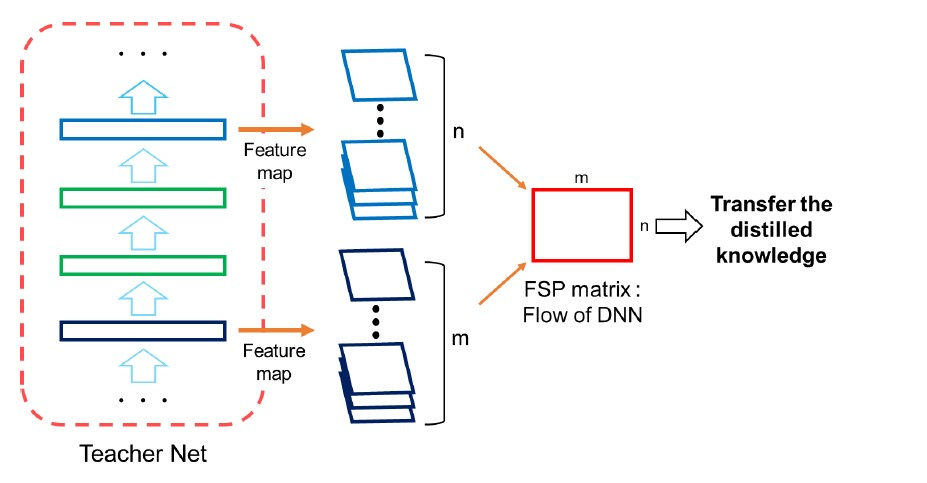

# [pcdarts-tf2](https://github.com/Stonepia/pcdarts-tf2)

<!-- [](https://lgtm.com/projects/g/peteryuX/pcdarts-tf2/context:python)


 -->


This repo is forked from [PCDARTS-TF2](https://github.com/peteryuX/pcdarts-tf2) and trying to combine the techniques of [PC-DARTS](https://arxiv.org/abs/1907.05737) with [RobNets](https://arxiv.org/abs/1911.10695).


> PC-DARTS is a memory efficient differentiable architecture search method, which can be trained with a larger batch size and, consequently, enjoys both faster speed and higher training stability. Experimental results achieve an error rate of **2.57%** on CIFAR10 with merely **0.1 GPU-days** for architecture search.

PC-DARTS is quick, this makes using adversarial training in Neural Architecture Search possible. This work, tries to add adversarial training as suggested in RobNets to generate more robust networks. 

Secondly, since using the same cell architecture for the whole network may not be the optimal solution, RobNets suggests that cells with Low FSP Loss may be more robust and may carry more information. This makes sampling from the supernet and generate various network accessable within limited computation budget. In later work, this will implement the various cell search method and compare the results.

Randomly sampled network are often used as a baseline for performance of the searched network. This part has also been implemented in the repo for future use.


Original Paper: 
- PC-DARTS &nbsp; [Arxiv]() &nbsp; [OpenReview](https://openreview.net/forum?id=BJlS634tPr)
- RobNets  &nbsp; [Arxiv]() &nbsp; 

Offical Implementation: 
- PC-DARTS &nbsp; [PyTorch](https://github.com/yuhuixu1993/PC-DARTS)
- RobNets &nbsp; [PyTorch](https://github.com/gmh14/RobNets)

<p align="center">
    
    
</p>

# Roadmap
- [x] Random generate network as a baseline
- [x] Introduce Adversarial Search Method into PC-DARTS
- [-] Calculate FSP Matrix for cells (working on)
- [ ] Select best cells according to FSP Loss
- [ ] Generate network by searched different cells
- [ ] Verify on Large Datasets


****

## Contents
:bookmark_tabs:

* [Installation](#Installation)
* [Usage](#Training-and-Testing)
* [Benchmark](#Benchmark)
* [Models](#Models)
* [References](#References)

***

## Installation
:pizza:

Create a new python virtual environment by [Anaconda](https://www.anaconda.com/) or just use pip in your python environment and then clone this repository as following.

### Clone this repo
```bash
git clone https://github.com/peteryuX/pcdarts-tf2.git
cd pcdarts-tf2
```
Note that the master branch may not contain the current developed method, you may also check other branches.

### Conda
```bash
conda env create -f environment.yml
conda activate pcdarts-tf2
```

### Pip

```bash
pip install -r requirements.txt
```

****

## Usage
:lollipop:

### Debugging
Set the `Debug` to `True` in files. Install `debugpy` and open a port if needed.

```bash
python -m debugpy --port 5678 train_search.py --cfg_path="./configs/pcdarts_cifar10_search.yaml" --gpu=0
```

### Config File
You can modify your own dataset path or other settings of model in [./configs/*.yaml](https://github.com/peteryuX/pcdarts-tf2/tree/master/configs) for training and testing, which would like below.

```python
# general setting
batch_size: 128
input_size: 32
init_channels: 36
layers: 20
num_classes: 10
auxiliary_weight: 0.4
drop_path_prob: 0.3
arch: PCDARTS
sub_name: 'pcdarts_cifar10'
using_normalize: True

# training dataset
dataset_len: 50000  # number of training samples
using_crop: True
using_flip: True
using_cutout: True
cutout_length: 16

# training setting
epoch: 600
init_lr: 0.025
lr_min: 0.0
momentum: 0.9
weights_decay: !!float 3e-4
grad_clip: 5.0

val_steps: 1000
save_steps: 1000
```

Note:
- The `sub_name` is the name of outputs directory used in checkpoints and logs folder. (make sure of setting it unique to other models)
- The `save_steps` is the number interval steps of saving checkpoint file.
- The [./configs/pcdarts_cifar10_search.yaml](https://github.com/peteryuX/pcdarts-tf2/tree/master/configs/pcdarts_cifar10_search.yaml) and [./configs/pcdarts_cifar10.yaml](https://github.com/peteryuX/pcdarts-tf2/tree/master/configs/pcdarts_cifar10.yaml) are used by [train_search.py](https://github.com/peteryuX/pcdarts-tf2/tree/master/train_search.py) and [train.py](https://github.com/peteryuX/pcdarts-tf2/tree/master/train.py) respectively, which have different settings for small proxy model training(architecture searching) and full-size model training. Please make sure you use the correct config file in related script. (The example yaml script above is [./configs/pcdarts_cifar10.yaml](https://github.com/peteryuX/pcdarts-tf2/tree/master/configs/pcdarts_cifar10.yaml).)

### Architecture Searching on CIFAR-10 (using small proxy model)

**Step1**: Search cell architecture on CIFAR-10 using small proxy model.

```bash
python train_search.py --cfg_path="./configs/pcdarts_cifar10_search.yaml" --gpu=0
```

Note:
- The `--gpu` is used to choose the id of your avaliable GPU devices with `CUDA_VISIBLE_DEVICES` system varaible.
- You can visualize the training status on tensorboard by running "`tensorboard --logdir=./logs/`". My logs can be found from [search_log](https://tensorboard.dev/experiment/SWu96NYrSlyIk7VRmCqjgw/) and [full_train_log](https://tensorboard.dev/experiment/lyI64MKgRAODUqv3V4rzjg/).
- You can visualize the learning rate scheduling by running "`python ./modules/lr_scheduler.py`".
- You can visualize the dataset augmantation by running "`python ./dataset_checker.py`".

**Step2**: After the searching completed, you can find the result genotypes in `./logs/{sub_name}/search_arch_genotype.py`. Open it and copy the latest genotype into the [./modules/genotypes.py](https://github.com/peteryuX/pcdarts-tf2/tree/master/modules/genotypes.py), which will be used for further training later. The genotype like bellow:

```python
TheNameYouWantToCall = Genotype(
    normal=[
        ('sep_conv_3x3', 1),
        ('skip_connect', 0),
        ('sep_conv_3x3', 0),
        ('dil_conv_3x3', 1),
        ('sep_conv_5x5', 0),
        ('sep_conv_3x3', 1),
        ('avg_pool_3x3', 0),
        ('dil_conv_3x3', 1)],
    normal_concat=range(2, 6),
    reduce=[
        ('sep_conv_5x5', 1),
        ('max_pool_3x3', 0),
        ('sep_conv_5x5', 1),
        ('sep_conv_5x5', 2),
        ('sep_conv_3x3', 0),
        ('sep_conv_3x3', 3),
        ('sep_conv_3x3', 1),
        ('sep_conv_3x3', 2)],
    reduce_concat=range(2, 6))
```

Note:
- You can visualize the genotype by running "`python ./visualize_genotype.py TheNameYouWantToCall`".
<p align="center">
    
    
</p>

### Training on CIFAR-10 (using full-sized model)

**Step1**: Make sure that you already modifed the flag `arch` in [./configs/pcdarts_cifar10.yaml](https://github.com/peteryuX/pcdarts-tf2/tree/master/configs/pcdarts_cifar10.yaml) to match the genotype you want to use in [./modules/genotypes.py](https://github.com/peteryuX/pcdarts-tf2/tree/master/modules/genotypes.py). 

Note:
- The default flag `arch` (`PCDARTS`) is the genotype proposed by official paper. You can train this model by yourself, or use dowload it from [BenchmarkModels](#Models).

**Step2**: Train the full-sized model on CIFAR-10 with specific genotype.

```bash
python train.py --cfg_path="./configs/pcdarts_cifar10.yaml" --gpu=0
```

### Testing on CIFAR-10 (using full-sized model)

To evaluate the full-sized model with the corresponding cfg file on the testing dataset. You can also download my trained model for testing from [Models](#Models) without training it yourself, which default `arch` (`PCDARTS`) is the best cell proposed in paper.

```bash
python test.py --cfg_path="./configs/pcdarts_cifar10.yaml" --gpu=0
```


### Training Random Networks
**Step1** : Generate random nets

```bash
python random_search.py [--cfg_path="./configs/pcdarts_cifar10.yaml" --gpu=0]
```
The searched architecture is stored in [./logs/*/search_random_arch_genotype.py], you may need to manually copy the arch into [./modules/search_random_arch_genotype.py] for training and testing. Or copy to [./modules/genotypes.py] for visualization.


To visualize the Searched architecture, use 
```bash
python visualize_genotype.py GENO_NAME
```


**Step2** : Training for Random Nets
```bash
python random_train.py [--cfg_path="./configs/pcdarts_cifar10.yaml" --gpu=0]
```

**Step3** : Testing for Random Nets
```bash
python random_testing.py [--cfg_path="./configs/pcdarts_cifar10.yaml" --gpu=0]
```


****

## Benchmark

### Results on CIFAR-10
| Method | Search Method | Params(M) | Accuracy(%)| Search-Cost(GPU-days) | Searched Epoches |
| ------ | ------------- | --------- | ------------ | --------------------- | ---------------|
| [PC-DARTS](https://github.com/yuhuixu1993/PC-DARTS) (Reported from paper) | gradient-based | 3.63 | **96.37** | **0.1** | 200 |
| PC-DARTS TF2 Random | - | 3.15 | 85.81 | - | 15 |
| PC-DARTS TF2 Random (with Attack) (small model) | gradient-based | 0.3 | 77.32 | - | 15|
| PC-DARTS TF2 (Natural) (big model) | gradient-based | 3.63 | 90.04 | 0.12 | 50| 

Note:
- Above results are referenced from [official repository](https://github.com/yuhuixu1993/PC-DARTS) and [orignal paper](https://arxiv.org/abs/1907.05737).
- The performance gap between my model and the paper is due to the lack of training resources. If trained on more epochs, it will gets a better results. 
- If you get unsatisfactory results with the archecture searched by yourself, you might try to search it more than one time. (see the discussions [here](https://github.com/yuhuixu1993/PC-DARTS/issues/7))

****

## Models
:doughnut:

Waiting for larger training resources.

****

## References
:hamburger:

Thanks for these source codes porviding me with knowledges to complete this repository.
- https://github.com/peteryuX/pcdarts-tf2 (TF2-Version)
    - PC-DARTS TF2 : The tensorflow version of PC-DARTS.
- https://github.com/yuhuixu1993/PC-DARTS (Official)
    - PC-DARTS:Partial Channel Connections for Memory-Efficient Differentiable Architecture Search
- https://github.com/quark0/darts
    - Differentiable architecture search for convolutional and recurrent networks https://arxiv.org/abs/1806.09055
- https://github.com/zzh8829/yolov3-tf2
    - YoloV3 Implemented in TensorFlow 2.0
